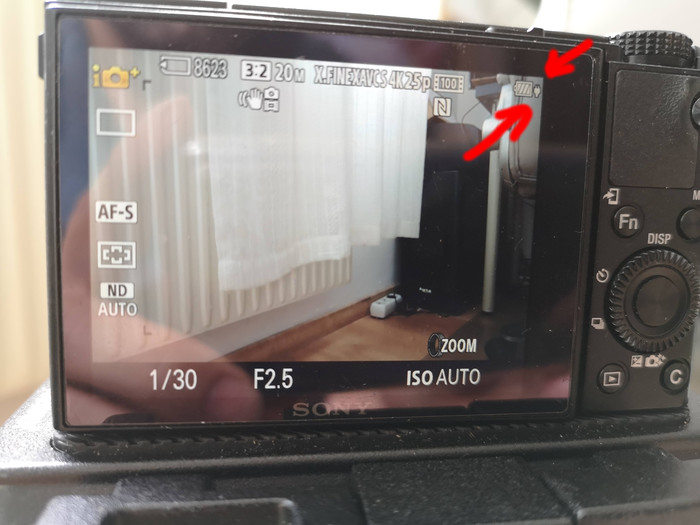
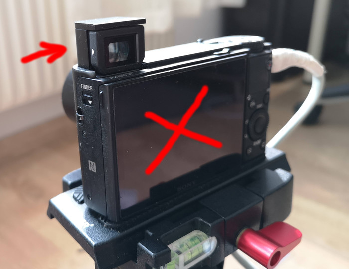
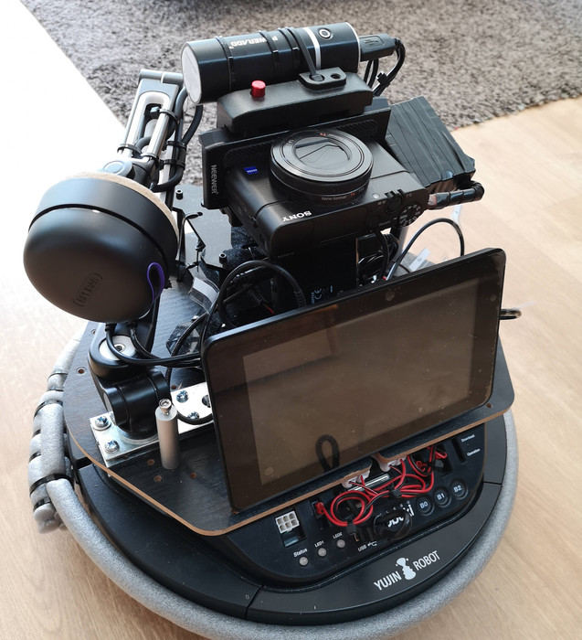

# Photogrammabot

Photogrammabot is an affordable autonomous robot for photography of an indoor environment for photogrammetry purposes. It is capable of exploring an unknown indoor environment, creating a map, and using map-based localization and navigation to navigate the environment and capture as many photos as it is instructed to for photogrammetry.


Watch this demo video which shows how the robot explores an unknown environment and take many photos. This video shows a simulated version of the robot in Gazebo.

[](https://youtu.be/lIOdErxPtLU)


---
---

## Changelog

See the Changelog file for more information.

---
---

## Using Photogrammabot

Here in this paper you can find more accurate information about Photogrammabot and the evaluation results. 

[Photogrammabot: An Autonomous ROS-Based Mobile Photography Robot for Precise 3D Reconstruction and Mapping of Large Indoor Spaces for Mixed Reality](https://ieeexplore.ieee.org/document/9757663)

Additionally, if you want to use Photogrammabot in full or partially in your own work and want to cite it, please use the following BibTex reference:

```
@INPROCEEDINGS{9757663,
   author={Mortezapoor, Soroosh and Schönauer, Christian and Rüggeberg, Julien and Kaufmann, Hannes},  
   booktitle={2022 IEEE Conference on Virtual Reality and 3D User Interfaces Abstracts and Workshops (VRW)},   
   title={Photogrammabot: An Autonomous ROS-Based Mobile Photography Robot for Precise 3D Reconstruction and Mapping of Large Indoor Spaces for Mixed Reality},   
   year={2022},  
   volume={},  
   number={},  
   pages={101-107},  
   doi={10.1109/VRW55335.2022.00033}
}
```

---
---

## Hardware

The robot is made of:
- [Kobuki base](http://kobuki.yujinrobot.com/about2/) with 8S2P 8800mAh battery as the base of the robot.
- [Raspberry Pi 4B 8GB RAM](https://www.raspberrypi.org/products/raspberry-pi-4-model-b/) and touchscreen display kit with Ubuntu-mate 18.04 and [ROS Melodic](http://wiki.ros.org/melodic) as onboard computer.
- [PhantomX micro turret](https://www.trossenrobotics.com/p/phantomX-robot-turret.aspx) with [ArbotiX-M Robotcontroller](https://www.trossenrobotics.com/p/phantomX-robot-turret.aspx) to control the angle of the camera.
- Sony Camera Multiport S2 adapter with charging capability.
- Sony Camera with external shutter trigger S2 multiport.
- Powerbank to supply power to Sony Camera.
- [Rplidar A3M1](https://www.slamtec.com/en/Lidar/A3) 25m range laser range scanner (LIDAR).

---
---

**System diagram and wiring**


## Installation

### __ Robot

1. Install necessary libraries.
   
    ```bash
    source automation/setup.bash
    ```
2. Copy USB rules to the following location:
   
    ```bash
    sudo cp automation/usb_rules/99-usb-serial.rules /etc/udev/rules.d/
    sudo udevadm trigger
    ```

3. Build the catkin workspace and source the setup file.
   ```bash
   cd CHANGEME_CATKIN_WS_FOLDER_PATH
   catkin build
   source devel/setup.bash
   ```

5. Add the env file to `.bashrc`.
   ```bash
   echo "source ~/PATH_TO_THIS_REPO/env/pgbot_env.sh" >> ~/.bashrc
   ```

6. Run the bringup launch file for the robot:
   ```bash
   roslaunch pgbot_bringup complete_robot.launch
   ```
   You can add this to startup in different ways, such as `systemd`.


If everything is correctly installed, you should hear different audio signals after about 30 seconds after executing this command, and the robot is ready for operation.

### __Remote computer

*PREREQUISITE: You should have Ubuntu 18.04 and ROS Melodic Desktop installed before proceeding.*

1. Install necessary libraries:
    ```bash
    source automation/setup.bash
    ```

2. Build the catkin workspace and source the setup file.
   ```bash
   cd CHANGEME_CATKIN_WS_FOLDER_PATH
   catkin build
   source devel/setup.bash
   ```

3. Connect the robot and the remote computer to the same network.
4. Add/modify the **ROS_MASTER_URI** environment variable to point to the robot in `~/.bashrc`. You should have a line like this in this file:
   ```bash
   export ROS_MASTER_URI=http://ROBOTIP:11311
   ```

5. Launch the rviz launch file of `pgbot_bringup`
   ```bash
   roslaunch pgbot_bringup rviz.launch
   ```

Now you should see the Rviz app with the robot visualized.

### Simulation:

To run the simulation, use the following launch file:

```
roslaunch pgbot_bringup complete_sim.launch
```

This will launch the simulation in Gazebo, as well as the visualization tool, Rviz.

---
---

## Operation


*Comment: This tutorial is made for the robot we built, which can be seen in the photos and also in the robot description file in the code. You may need to skip/adapt some of the steps to your robot if you should decide to make any changes in the structure of the components.*

1. Unfold the LIDAR and make it straight up. Use the level bubble tubes below the LIDAR to make sure it is level somewhat. If the bubble stays in the indicated space, it must be good enough. Please DO NOT touch the LIDAR itself and try to use the handle for adjustments.

   

2. Make sure the RPi switch is in the off (0) position.

   
   
3. Turn on the Kobuki base. You should hear a beep sound when it is on. Also, the Status LED of the robot turns green.

   
   


4. Turn on the control computer. The display should show a rainbow screen for a couple of seconds and then boot up the Ubuntu-mate Xenial operating system.

   
   

   If the computer is stuck on the rainbow screen, try turning off the Kobuki base, waiting for a few seconds, and turning it on.

5. Wait for an audio signal. This signal is played once and not repeatedly. This signal shows that the control computer is connected to the Kobuki base. This can take up to 30 seconds after the OS boots up. With this audio signal, the LIDAR should start to spin.

   

6. Wait for a repeating audio signal and a green light on LED1 of the Kobuki base. When you hear this audio signal, the robot is ready for operation. This can take up to several seconds after the previous audio signal. Meanwhile, the camera should move to the forward0, meaning that toward the heading of the robot at 0° horizontally.

   

7. If the powerbank of the camera is off, turn it on. When turned on, the LEDs of the power bank should be on and one of them blinking, meaning that the powerbank is being charged simultaneously from the robot's battery.

   
   

8. Under 10 seconds after turning on the power bank, the camera will recognize it and start charging s.t. the LED in the middle of its power button should turn orange.

   

9.  Turn on the camera. The camera should show the "recharing" icon on the top right corner of its screen².

   

10. Open the viewfinder of the camera to turn off the main display. This will reduce the battery usage by the camera.

   
   
    

11. Push the B0 button to start the operation. Both LED1 and LED2 of the Kobuki base should turn orange. The LED2 will turn red when the robot begins shooting photos.

   


Now the robot should start exploring the area autonomously. Once finished exploring and creating a map, the robot makes a set of waypoints to cover the entire explored area and take photos. Once finished, both LED1 and LED2 are green, meaning that the photography operation has been done successfully.

### On the remote computer

You can visualize the data of the robot on a remote computer. For this, connect to the robot's WiFi, or connect the robot and the remote computer to the same network, then use the following command. Make sure that you have installed ROS and the necessary packages. See *installation* for those.

```
   roslaunch pgbot_bringup rviz.launch
```

Now you should be able to see the customized Rviz view like the one shown in the following figure.

   

### Notes:

- **The number and angle of the photo shootings** at each waypoint can be configured using the CAMERA_POSES environment variable. This variable can be found in `env/pgbot_env.sh`.

- **The pan 0° of the turret** is not the heading of the robot but toward the right side of the robot. The turret can rotate from -150° to 150°. Setting a pan out of this range can harm the turret.

   

- **The tilt 0° of the turret** is toward the ceiling. It is recommended to use -85° rather than -90° for taking photos from the ceiling as the weight of the camera can also add to the desired tilt angle.

   

- **To PAUSE/RESUME** the operation of the robot while exploring or taking photos, use the **B1** button. This can toggle between pause and play states.

   


- **Kobuki LED values**
  
  These are the meaning of the LEDs

   | Value  | LED1             | LED2                          |
   |--------|------------------|-------------------------------|
   | OFF    | System not ready | Not in operation              |
   | Green  | Ready to start / Process completed (together with LED2)   | Process completed           |
   | Orange | In progress      | Exploration and mapping phase |
   | Red    | Error in results | Photography phase             |
---
*¹ Camera home position: The following shows the camera's home position.*

   


*² Camera recharging: If the camera is not recharged during the operation, as its internal battery does not have enough capacity for the entire operation, the camera will run out of battery before completing the operation.*

---
---

## FAQ

**The RPi stuck on the rainbow screen.**

Turn off the Kobuki base, wait for 5 seconds and turn it back.

Also, the wiring of the robot and its different components have some considerations, and changing the wirings might introduce problems. For instance, an active USB hub or an externally powered device should not be connected directly to RPi.

** display has a lightning sign at the top right corner**

The lightning means that the RPi detected undervoltage. This could be due to a battery problem.

**Connect the robot to a WiFi network**

The robot automatically creates a hotspot to which you can connect. Alternatively, you can connect the RPi to the WiFi network of your environment.

**Status LED of Kobuki is orange**

It means that the robot is low on battery and should be recharged. A low battery can cause the onboard RPi to restart frequently and/or boot problems.

